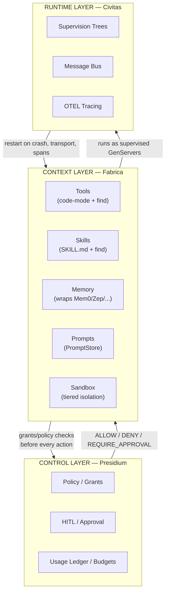
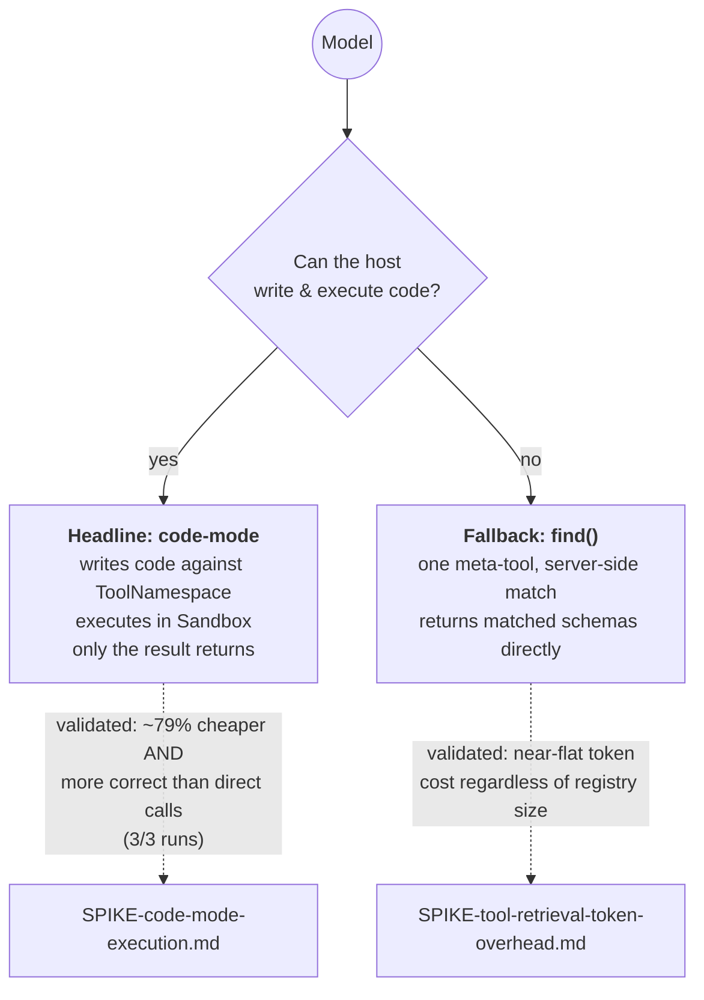
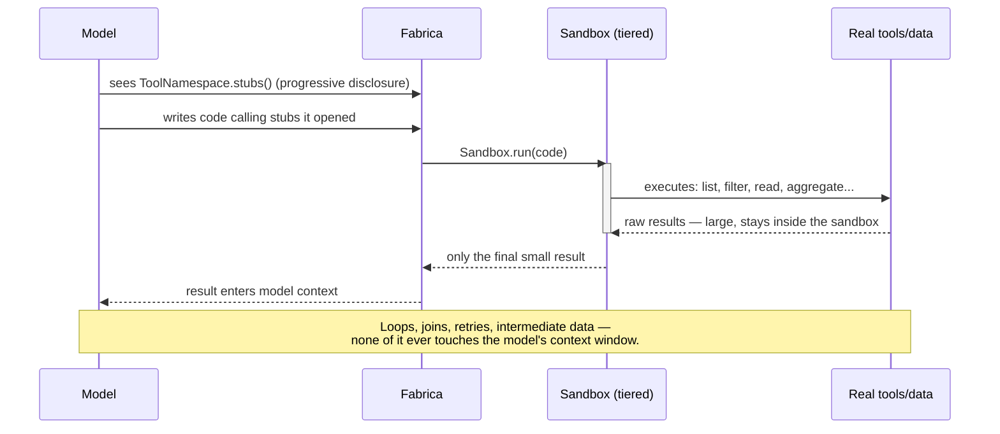
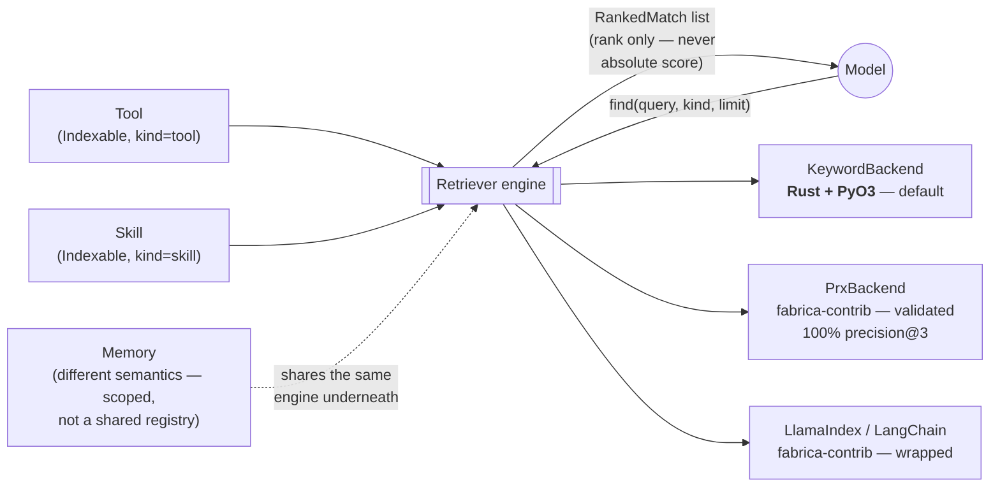
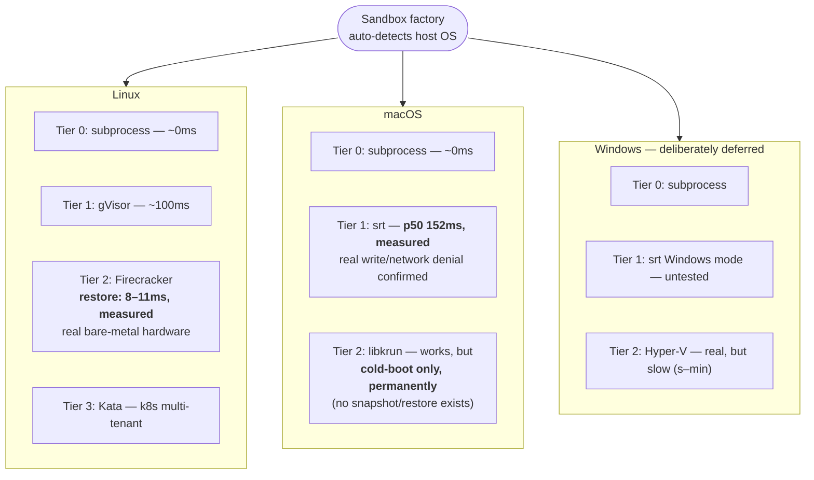
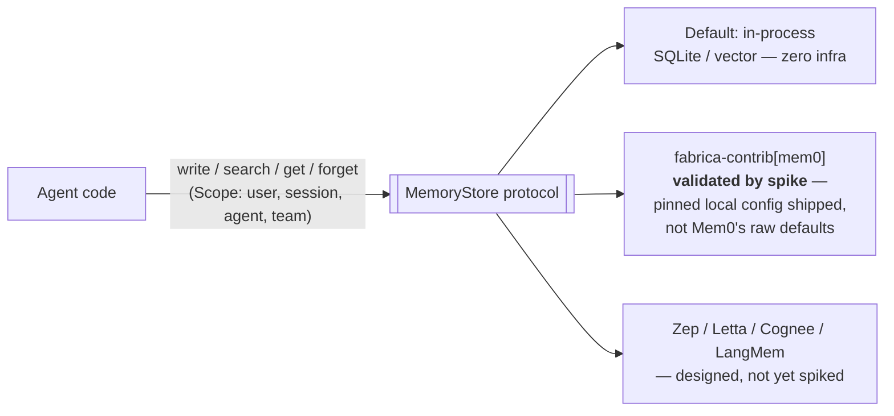
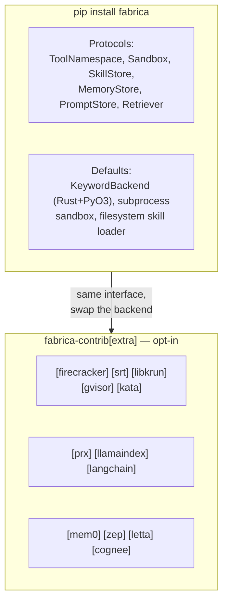
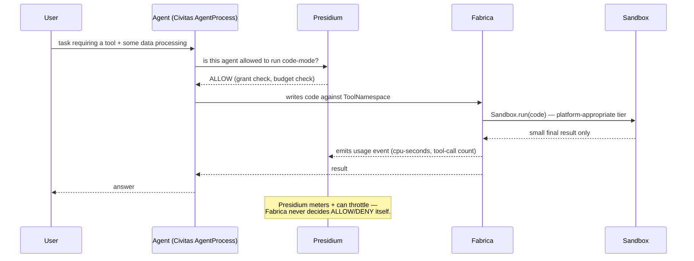

# Fabrica: Architecture Walkthrough

**Status:** Design, validated by seven spikes · **Last updated:** 2026-08

This doc is the visual entry point into the design — each section builds on the
last. For the reasoning behind any decision shown here, follow the links into the
component docs; for the evidence behind any number, follow the links into
`specs/archive/spikes/`.

---

## 1. Where Fabrica sits

Three pillars, one platform. Fabrica is the middle layer conceptually (shapes
context) but architecturally sits *between* the model and Civitas, governed by
Presidium at every boundary crossing.

**The one-line version:** Civitas keeps agents alive. Presidium keeps them
accountable. Fabrica decides what they see and how they act on it. Full detail:
[context-layer.md](context-layer.md).

---

## 2. The two ways a model gets a capability

Fabrica offers exactly two paths, deliberately — a headline and a fallback, not a
menu of options. **Both are now validated by spike, not just designed.**

**Why code-mode wins, concretely** (not just "it's cheaper"):

| | Traditional tool-calling | Code-mode |
|---|---|---|
| Filtering/counting | model estimates by reading text | real Python arithmetic in the sandbox |
| Measured correctness | **wrong in 3/3 test runs** (16–48% off) | **exact in 3/3 test runs** |
| Token cost (same task) | 23,392–23,592 | 4,826–4,904 (~79% less) |

Full design: [tool-execution.md](tool-execution.md). Evidence:
[SPIKE-code-mode-execution.md](../specs/archive/spikes/SPIKE-code-mode-execution.md).

---

## 3. Code-mode execution, step by step

This is the mechanism behind the ~98.7% token reduction Anthropic/Cloudflare
reported (`landscape.md §1`) — Fabrica's version is vendor-neutral and
self-hostable, running on a Civitas-supervised process instead of a
vendor-locked platform.

---

## 4. The shared retrieval engine (tools + skills, unified)

Both the `find()` fallback and skill discovery run on **one** engine, not two —
resolved this way after measurement showed the original separate skill-index
design wasn't actually flat ([SPIKE-skill-progressive-disclosure.md](../specs/archive/spikes/SPIKE-skill-progressive-disclosure.md)).

**Two hard rules baked into the protocol**, both surfaced by spike, not
guessed at:
1. **Rank, never absolute threshold** — correct hits and near-misses can land in
   the same low score band (0.01–0.04 observed).
2. **Persistent-process integration** for any external backend (like prx) — a
   supervised Civitas child, not a fresh subprocess per call.

Full design: [retrieval.md](retrieval.md).

---

## 5. Isolation: platform-dispatched, not one technology

The backend is **auto-detected by host OS and hidden from users** — a deliberate
exception to how Civitas normally exposes config (transport selection *is* a
user choice; isolation backend is not).

**Two decisions worth remembering, both made explicitly, not by default:**
- macOS Tier 2 ships despite the cold-boot ceiling — *"snapshot/restore is great
  to have, not a must."*
- Windows is deliberately under-invested — small segment, revisit only if a real
  gap forces it.

Full design + the corrected boot-time distinction (VMM-ready vs. actually-usable):
[isolation.md](isolation.md).

---

## 6. Memory: wrap, with a working default — not the raw library

The spike found Mem0's own defaults require an OpenAI API key just to
instantiate — directly contradicting a zero-infra assumption until explicitly
reconfigured. The adapter therefore ships **its own pinned local config**
(fastembed + chroma + `infer=False`), so that friction never reaches a user.
Evidence: [SPIKE-memory-mem0-wrap.md](../specs/archive/spikes/SPIKE-memory-mem0-wrap.md).

---

## 7. Package structure

**Engineering principle applied throughout:** where Fabrica *builds* compute
internals (like the default `KeywordBackend`), it's Rust with a Python binding —
matching prx's own shape — not pure Python. Wrapped libraries (Mem0, LlamaIndex,
prx itself) are unaffected. Detail: [context-layer.md](context-layer.md#engineering-principle-rust-for-compute-python-for-interface).

---

## 8. How it all closes the loop — one request, start to finish

This is the seam map from [civitas-presidium-integration.md](civitas-presidium-integration.md)
made concrete as a single request's lifecycle.

---

## Where to go next

| If you want... | Go to |
|---|---|
| The personas this was designed for | [personas.md](personas.md) |
| Per-persona success metrics | [problem-definition.md](problem-definition.md) |
| Every claim checked against evidence | [critique.md](critique.md) |
| Raw spike data | [`specs/archive/spikes/`](../specs/archive/spikes/) |
