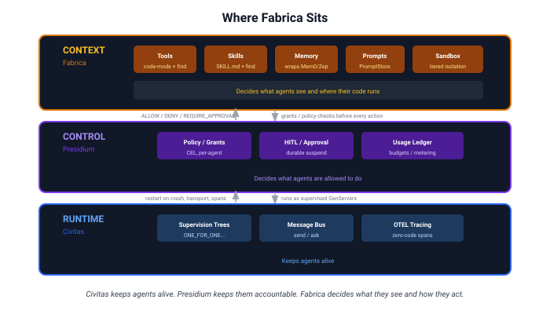
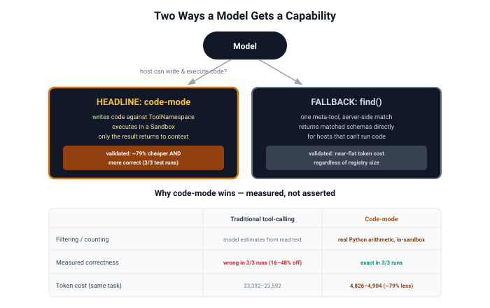
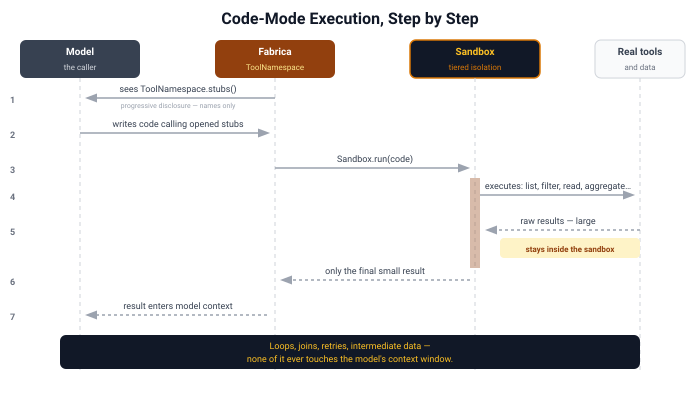
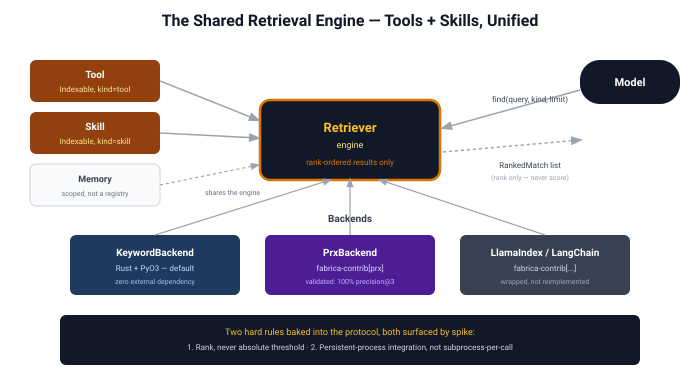
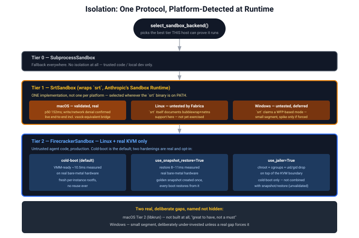
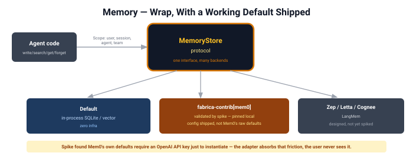
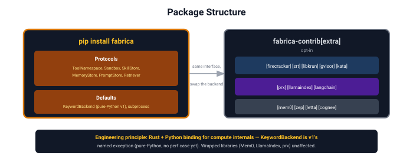
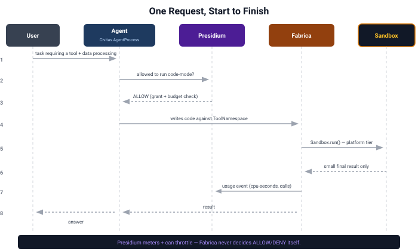

# Fabrica: Architecture Walkthrough

**Status:** Design, validated by seven spikes · **Last updated:** 2026-08

This doc is the visual entry point into the design — each section builds on the
last. For the reasoning behind any decision shown here, follow the links into the
component docs; for the evidence behind any number, follow the links into
`specs/archive/spikes/`.

---

## 1. Where Fabrica sits

Three pillars, one platform. Fabrica is the middle layer conceptually (shapes
context) but architecturally sits *between* the model and Civitas, governed by
Presidium at every boundary crossing.

**The one-line version:** Civitas keeps agents alive. Presidium keeps them
accountable. Fabrica decides what they see and how they act on it. Full detail:
[context-layer.md](context-layer.md).

---

## 1a. A platform-wide principle, named explicitly: library-first, low coupling, high cohesion

This has been driving decisions throughout the whole design without ever being
stated as a rule until it was challenged directly (see [memory.md](memory.md#related-work-and-a-deliberate-divergence)
for the case that surfaced it). Naming it now, retroactively, because several
earlier decisions only make full sense in light of it:

**Every component is designed as an independently reusable library first --
only the orchestrator layer (`CivitasBridge`, or Civitas itself) is allowed to
be tightly integrated.** A component should work if someone imports *just that
piece* and nothing else -- `Retriever` without `Sandbox`, `Compactor` without
`MemoryStore`, `prx` without any of Fabrica at all. This is a stronger
constraint than ordinary interface-driven design: it's not just "swap the
implementation behind a Protocol," it's "the pieces must not need each other's
internal knowledge to function correctly on their own."

Decisions this explains, made independently, now revealed as one pattern:

- **`ToolManager`/`SkillManager` stayed separate classes**, not unified
  despite real overlap, because they have genuinely different trust models --
  fusing them would couple two things that should be independently
  understandable (`system-design.md` §1).
- **`prx`/`tessera` live entirely outside Fabrica**, not as an integrated
  sub-module, despite solving an adjacent problem -- different consumer,
  different distribution, and forcing them into Fabrica would couple two
  things that don't need to know about each other (`HANDOFF.md`).
- **`MemoryManager`'s three facets deliberately do *not* share one unified
  retrieval/retention score**, even though the most influential prior art
  (Generative Agents' memory stream) uses exactly one composite formula across
  ingestion, retrieval, and forgetting. A shared score would require
  `WorkingMemoryStore`, `Compactor`, and `MemoryStore` to know about each
  other's internal signals -- the opposite of low coupling. Each stays a
  standalone, swappable library; only `MemoryManager` (the orchestrator for
  *this* component) composes them, and nothing above it needs to know that
  composition happened. See
  [memory.md](memory.md#related-work-and-a-deliberate-divergence).

---

## 2. The two ways a model gets a capability

Fabrica offers exactly two paths, deliberately — a headline and a fallback, not a
menu of options. **Both are now validated by spike, not just designed.**

Full design: [tool-execution.md](tool-execution.md). Evidence:
[SPIKE-code-mode-execution.md](../specs/archive/spikes/SPIKE-code-mode-execution.md).

---

## 3. Code-mode execution, step by step

This is the mechanism behind the ~98.7% token reduction Anthropic/Cloudflare
reported (`landscape.md §1`) — Fabrica's version is vendor-neutral and
self-hostable, running on a Civitas-supervised process instead of a
vendor-locked platform.

---

## 4. The shared retrieval engine (tools + skills, unified)

Both the `find()` fallback and skill discovery run on **one** engine, not two —
resolved this way after measurement showed the original separate skill-index
design wasn't actually flat ([SPIKE-skill-progressive-disclosure.md](../specs/archive/spikes/SPIKE-skill-progressive-disclosure.md)).

Full design: [retrieval.md](retrieval.md).

---

## 5. Isolation: platform-dispatched, not one technology

The backend is **auto-detected by host OS and hidden from users** — a deliberate
exception to how Civitas normally exposes config (transport selection *is* a
user choice; isolation backend is not).

Full design + the corrected boot-time distinction (VMM-ready vs. actually-usable):
[isolation.md](isolation.md).

---

## 6. Memory: wrap, with a working default — not the raw library

The spike found Mem0's own defaults require an OpenAI API key just to
instantiate — directly contradicting a zero-infra assumption until explicitly
reconfigured. The adapter therefore ships **its own pinned local config**
(fastembed + chroma + `infer=False`), so that friction never reaches a user.
Evidence: [SPIKE-memory-mem0-wrap.md](../specs/archive/spikes/SPIKE-memory-mem0-wrap.md).

---

## 7. Package structure

**Engineering principle, with one real, named v1 exception:** where Fabrica
*builds* compute internals, the principle is Rust with a Python binding —
matching prx's own shape — not pure Python. **`KeywordBackend`, the
diagram's own example, is the exception**: it shipped v1 as pure-Python
`rank_bm25` instead, a deliberate call made once there was no performance
evidence yet to justify the tooling cost ("ship the default, revisit if
forced"). Wrapped libraries (Mem0, LlamaIndex, prx itself) are unaffected
either way. Detail: [context-layer.md](context-layer.md#engineering-principle-rust-for-compute-python-for-interface),
[retrieval.md](retrieval.md#backends--rust-for-the-built-parts-wrap-everything-else-with-one-real-named-v1-exception).

---

## 8. How it all closes the loop — one request, start to finish

This is the seam map from [civitas-presidium-integration.md](civitas-presidium-integration.md)
made concrete as a single request's lifecycle.

---

## Where to go next

| If you want... | Go to |
|---|---|
| The personas this was designed for | [personas.md](personas.md) |
| Per-persona success metrics | [problem-definition.md](problem-definition.md) |
| Every claim checked against evidence | [critique.md](critique.md) |
| Raw spike data | [`specs/archive/spikes/`](../specs/archive/spikes/) |
