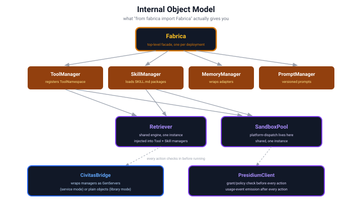
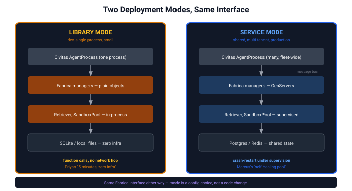
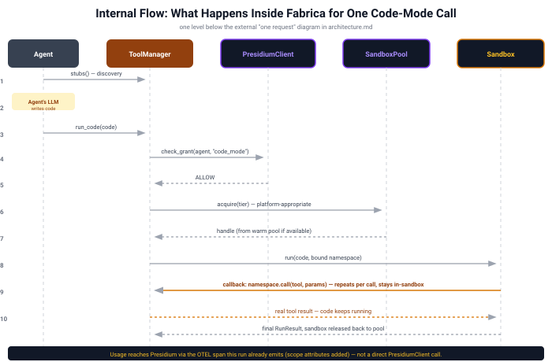

# System Design

**Status:** Design, pre-contracts · **Last updated:** 2026-08
**Precedes:** contracts (exact signatures, error types, async behavior)
**Follows:** [architecture.md](architecture.md) (what & why) — this doc is the how

This is the layer between "what Fabrica is" (`architecture.md`) and "what code do
I write" (contracts, not yet written). It answers questions architecture.md
deliberately left as boxes-and-arrows: what are the actual Python objects, who
owns what state, what happens when something fails, what gets traced.

---

## 1. Internal object model

What `from fabrica import Fabrica` actually gives you — one facade, four domain
managers, two shared engines injected into the managers that need them, and two
bridge objects that connect outward to Civitas and Presidium.

**Why `Retriever` and `SandboxPool` are shared, singular instances**, not one per
manager: `retrieval.md`'s whole thesis is that tools and skills use *the same*
engine (that's what fixed the O(1)-vs-linear gap). Duplicating `Retriever`
per-manager would silently reintroduce the bug that unification fixed. Same logic
for `SandboxPool` — one pool, drawn from by both code-mode tool execution and
skill script execution, not two pools competing for the same host resources.

**Why `ToolManager` and `SkillManager` stay separate classes, not one generic
manager:** they look similar (both register into `Retriever`, both run things in
`SandboxPool`) but differ in ways that matter — `ToolManager` registers
developer-authored namespaces and executes *arbitrary, freshly-generated* code;
`SkillManager` parses the `SKILL.md` file format and executes *pre-written,
author-trusted* scripts by name with structured args. Forcing one class to cover
both would mean branching on `kind` inside what should be a clean abstraction.
**What they do share — composition, not inheritance:** the orchestration around
execution (check grant → acquire sandbox → run → release → handle errors → emit
spans) is identical regardless of what's being executed. Both call a single
shared helper, `execute_in_sandbox(presidium_client, sandbox_pool, action, ...)`,
for that part — the same dependency-injection pattern `Retriever` and
`SandboxPool` already use, extended to the one piece of logic that was actual
copy-paste risk, without conflating two different trust models into one class.

**Why `CivitasBridge` and `PresidiumClient` are separate objects**, not methods
on `Fabrica` itself: they're the only two places this system talks to something
outside itself. Isolating them means every outbound call — to the runtime, to
governance — goes through one seam, which is where mocking, circuit-breaking, and
the fail-closed behavior in §6 all live in one place instead of scattered across
four managers.

**Correction: `CivitasBridge` must have the same shape as `PresidiumClient`, not
just sit next to it.** An earlier version of this section (and the component
matrix in §4) described `CivitasBridge` as something that "registers GenServers
with the supervision tree" — language that implies reaching into Civitas's
supervision tree and manipulating it directly. That's inconsistent with
`PresidiumClient`'s own design one paragraph below: `check_grant` **asks**
Presidium a question; Presidium's own internal logic decides the answer, and
`PresidiumClient` never reaches into Presidium's internals to decide it itself.
**`CivitasBridge` must work the same way toward Civitas: it requests, Civitas
performs.** `CivitasBridge` never touches a supervision tree or a `StateStore`
directly — it calls `request_supervision(component_name, spec) -> SupervisionHandle`
and `request_state_persistence(key, ...) -> StateHandle`; Civitas's own runtime
decides how to fulfill each request and performs the actual registration or
write. This also means **no manager talks to Civitas directly, even for
state persistence** — `PromptManager`'s and `MemoryManager`'s dependence on
Civitas's `StateStore` (§4–§5) is mediated through `CivitasBridge`'s
`request_state_persistence`, not a direct call from the manager itself. Without
this correction, the earlier phrasing would have quietly created a *third*
place this system talks outward, contradicting the very sentence above it that
says there are only two. This same request-not-reach-in rule is also what keeps
any future, bounded extension of `CivitasBridge`'s scope (discussed and
deliberately deferred) from becoming an exception to this pattern later — the
rule doesn't get renegotiated as scope grows, it's applied consistently
regardless of what `CivitasBridge` eventually does.

**`PresidiumClient` is deliberately smaller than it first looks.** Presidium is a
genuinely separate deployment (not co-located with Civitas), reached over REST +
mTLS — so `PresidiumClient` has exactly **one** method: `check_grant`/`check_policy`,
synchronous (you can't proceed without knowing ALLOW/DENY), circuit-breaker
protected, fail-closed on timeout or an open breaker. There is **no**
`emit_usage_event` method. Usage reaches Presidium as attributes on the OTEL spans
Fabrica already emits for its own observability (§7) — async by construction
(OTEL's exporter batches in the background), reusing existing plumbing instead of
building a second one. Presidium implements its own span consumer watching for
`fabrica.*` spans; that consumer is Presidium's concern, not something
`PresidiumClient` calls out to.

---

## 2. Deployment topology: library mode vs. service mode

Every manager, plus `Retriever` and `SandboxPool`, works both ways. The interface
above doesn't change — only what's underneath it.

**This isn't a spectrum — it's a binary per-deployment choice**, matching how
Civitas and Presidium already work. A team doesn't run "70% service mode"; they
run library mode until they outgrow it, then flip to service mode, same interface,
zero application-code changes. `CivitasBridge`'s job (§1) is entirely this: decide
once, at construction time, which shape each manager takes.

**Phased, deliberately — v1 is one flag, v2 is per-component, and v2 doesn't
break v1.** `Fabrica` takes a single top-level `mode: "library" | "service"` in
v1; `CivitasBridge` propagates that one value uniformly to every manager,
`Retriever`, and `SandboxPool`. But `CivitasBridge` treats mode selection as a
**per-component decision internally from day one** — v1 just always passes the
same value to every component. This makes v2 (per-component overrides, e.g.
`Fabrica(mode="library", overrides={"sandbox_pool": "service"})`, for when
Marcus needs the warm pool to scale independently of everything else) a purely
**additive** feature later, not a rework: nothing about the internal wiring or
the public contract assumes uniformity, v1 just happens to always request it.

---

## 3. Internal flow: one code-mode call, in detail

`architecture.md §3` and `§8` show this from the outside (model↔Fabrica, then
user↔agent↔Fabrica). This is what happens **inside** Fabrica for a single call —
including a detail neither of those diagrams shows: the sandbox doesn't have
magic access to real tools. It calls back into `ToolManager` for every real tool
invocation the generated code makes.

**The callback loop (step 9) is the load-bearing detail.** It's *why*
intermediate data never leaves the sandbox: the generated code calls
`namespace.call(tool, params)`, that call crosses back to `ToolManager` (which
actually has network/filesystem/API access), the real result crosses back in —
but only the *next* line of generated code sees it, not the model. This is the
mechanism, not a diagram simplification. Getting the callback transport wrong
would break the whole token-savings story from
[SPIKE-code-mode-execution.md](https://github.com/civitas-io/fabrica/blob/main/specs/archive/spikes/SPIKE-code-mode-execution.md).

**The callback transport, resolved:** a shared wire protocol (ZMQ) over a
tier-specific bridge — not one uniform transport, and not a different RPC
implementation per tier either:

- **Tier 0/1** (no real VM boundary — subprocess, gVisor, `srt`): ZMQ binds
  directly via `ipc://` (Unix domain socket). No relay needed — guest and host
  share a kernel.
- **Tier 2** (real VM boundary — Firecracker, libkrun, eventually Hyper-V): a
  small relay, baked into the guest image the same way the tool-namespace shim
  already is, speaks ZMQ locally to the sandbox-side shim and bridges those
  bytes across the actual platform-specific channel — `vsock` for Firecracker,
  `VZVirtioSocketDevice` for libkrun, `AF_HYPERV` for Hyper-V — to a matching
  bridge on the host side, which re-exposes ZMQ to `ToolManager`.

This means `ToolManager` and the sandbox-side shim speak **only ZMQ, always**
— tier/platform-specific complexity collapses into one small, isolated relay
component instead of being spread across the application-level RPC code. It
may also let Fabrica reuse Civitas's own ZMQ transport implementation (already
part of its scaling ladder) rather than hand-rolling a second one. The relay is
trusted, Fabrica-controlled infrastructure the generated code never touches
directly — the same trust boundary as the tool-namespace shim already
described in `isolation.md`.

**Sanity-checked:** [SPIKE-zmq-sandbox-channel-feasibility.md](https://github.com/civitas-io/fabrica/blob/main/specs/archive/spikes/SPIKE-zmq-sandbox-channel-feasibility.md)
confirmed Tier 0/1's half of this — `pyzmq` bundles its own statically-compiled
`libzmq` (1.6MB, self-contained, no system dependency chain needed), and a real
`ipc://` round trip measured **0.73ms**, negligible overhead. **Still not
verified:** the Tier 2 relay bridge itself (`vsock`/`VZVirtioSocketDevice`/
`AF_HYPERV`) and behavior inside an actual booted guest rather than the same
OS/arch on bare metal — the harder half of this design, deliberately left for
its own dedicated spike rather than attempted alongside the easier half.

---

## 4. Component responsibility matrix

**Correction, matching `contracts/civitas-bridge.md`'s own "Correction
found during implementation" section**: earlier revisions of this table
labeled every manager below "GenServer" under Service mode. Reading
`civitas.runtime.Runtime.spawn`'s and `DynamicSupervisor`'s real
implementation found this structurally doesn't fit -- dynamic-spawn
reconstructs a class from a dotted path with only `name`, no way to
hand it an already-constructed object holding live dependencies. This
table was never actually fixed to say so until now, silently
contradicting `civitas-bridge.md`'s own, correct account of the same
finding -- caught while walking through `PLAN.md` item 22 directly with
the user (Civitas's own maintainer), not found by inspection alone. See "Finding: managers as supervised GenServers, investigated but not
built" below for the full reasoning, including why this isn't just a
technical blocker to work around.

| Component | Owns | Depends on | Library mode | Service mode |
|---|---|---|---|---|
| `Fabrica` | top-level config, wiring | all managers | plain object | plain object (always — it's the entry point, never itself a GenServer) |
| `ToolManager` | `ToolNamespace` registration, code-mode orchestration | `Retriever`, `SandboxPool`, `PresidiumClient`, shared `execute_in_sandbox` helper | in-process | plain object, same constructor-injected shape as library mode -- NOT a GenServer (see correction above) |
| `SkillManager` | `SKILL.md` loading, skill execution orchestration | `Retriever`, `SandboxPool`, `PresidiumClient`, shared `execute_in_sandbox` helper | in-process | plain object, same as library mode |
| `MemoryManager` | adapter lifecycle (Mem0 etc.) | configured `MemoryStore` adapter | in-process | plain object; only its PERSISTENT STATE moves to a `ComponentStateHandle` backed by Civitas's real `StateStore` (`contracts/memory.md`'s `PersistedMemoryStore`) -- the manager object itself is not a GenServer |
| `PromptManager` | `PromptStore` | Civitas `StateStore`, mediated through `CivitasBridge.request_state_persistence` — never called directly (§1's correction) | in-process | plain object; same persistent-state-only distinction as `MemoryManager` (`PersistedPromptStore`) |
| `Retriever` | index, search | `KeywordBackend` (default) or an adapter | in-process, local index | plain object, same as library mode -- "shared fleet-wide" (if ever needed) means pointing multiple replicas' `Retriever`s at the same real external `RetrieverBackend`, not making `Retriever` itself a GenServer |
| `SandboxPool` | tier selection, pool of handles, platform dispatch, **baking the guest image** (tool-namespace shim +, for Tier 2, the ZMQ relay) | a `Sandbox` backend (subprocess/gVisor/Firecracker/`srt`/libkrun) | in-process, small pool | plain object, same as library mode -- see the finding below for why crash-resilience here is better served by process-level supervision than per-manager GenServer-ification |
| `CivitasBridge` | mode selection at construction time; the ONLY caller of `request_supervision`/`request_state_persistence` | Civitas `Runtime` | no-op | `request_supervision` is real and tested against Civitas's real `Runtime`/`DynamicSupervisor`, available for a genuinely fresh, self-contained `GenServer` class -- but no manager in this codebase calls it (see the finding below) |
| `PresidiumClient` | grant/policy checks only — no usage-emission method | Presidium's REST endpoint (mTLS) | same: REST + mTLS, circuit-breaker protected (Presidium is always a separate deployment, not affected by Fabrica's own mode) |

---

## Finding: managers as supervised GenServers, investigated but not built

`PLAN.md` item 22 ("managers as supervised GenServers, 'self-healing
pool'") was walked through directly with the user -- Civitas's own
maintainer -- rather than decided unilaterally, per this project's own
norm for architecture-level calls. Recorded here in full, not just as a
commit message, since the reasoning matters as much as the conclusion.

**The technical blocker, confirmed against real Civitas source, not
assumed**: `Runtime.spawn()` reconstructs an agent from a dotted class
path via `agent_class(name=child_name)` -- only `name`, nothing else --
then bolts a small fixed set of attributes on afterward
(`agent._bus`/`agent.llm`/`agent.tools`/`agent.store`/`agent.config`).
`spawn()` itself returns only the spawned name, never a reference to the
live instance. There is no path for a manager built as
`ToolManager(retriever, sandbox_pool, presidium_client)` -- three live,
stateful, non-reconstructible objects -- to survive this. Full detail:
`contracts/civitas-bridge.md`'s own "Correction found during
implementation" section.

**Why this isn't just a mechanism gap to work around**: the maintainer
confirmed `class_path`/`name`/`config` was never meant to be a
permanent, hardened contract -- it's an early, simpler stand-in for a
much more ambitious, genuinely unresolved idea: serializing a running
process's real state and moving ("teleporting") it to another node,
resuming from suspension -- true node-failure resilience and trivial
autoscaling, closer to Erlang-style process mobility than a simple
restart-from-config. Real, worth pursuing on its own merits -- but
tested here against whether Fabrica's own managers are a good
motivating use case for it, and they aren't:

- **`SandboxPool`'s interesting state -- live warm handles (real
  Firecracker VMs, real subprocess PIDs, real sockets) -- is physically
  tied to one host's hardware.** A running KVM guest cannot be
  serialized and resumed on different hardware; that's not a
  Python-object-serialization problem, it's "the VM exists on this
  hypervisor." If the node dies, that warm pool is gone regardless of
  migration technology. What *would* survive is just the pool's
  configuration (backend choice, sizing) -- reconstructing a fresh pool
  from that on a new node, cold-booting new sandboxes there, is both
  achievable TODAY with the existing simple spawn mechanism and the
  CORRECT behavior anyway.
- **`Retriever`'s registered catalog** is genuinely serializable, but
  trivially re-derivable -- whatever called `register()` at startup can
  just do it again on a fresh instance. Nothing expensive is lost by
  not migrating it.
- **`MemoryManager`/`PromptManager`** already delegate nearly all real
  state to an external, durable backend (`MemoryStore`/`PromptStore`) --
  the manager object itself holds almost nothing worth preserving.
- **`ToolManager`/`SkillManager`**'s registered namespaces often wrap
  live things themselves (closures, real MCP client connections) that
  aren't cleanly serializable regardless of what Civitas does.

None of Fabrica's managers hold the thing that would actually justify
live migration: expensive-to-reconstruct state that isn't either
host-bound-and-therefore-non-transferable, or trivially replayable from
an external source of truth. Building the bigger capability just for
Fabrica's sake would undersell what it deserves as a use case.

**What Fabrica's real, narrower need actually is**: `SandboxPool`'s own
bookkeeping (warm-handle list, background refill tasks, a condition
variable coordinating them) is the one place genuinely fragile,
long-lived internal state exists. If an undiscovered bug wedges it, the
pool degrades quietly. That's a process-CRASH-RECOVERY problem, not a
migration problem -- and it's already substantially addressed if the
whole Fabrica-embedding process sits under ORDINARY Civitas supervision
(even a plain static child in the topology, no dynamic spawn needed at
all): a crash already triggers Civitas's existing restart mechanism,
cold-booting a fresh `Fabrica`/`SandboxPool` via ordinary
`CivitasBridge.build()`. Real resilience today, just at process
granularity instead of per-manager.

**Resolved as a documented finding, not a rejection** -- this project
has never run in real production under real failure conditions, so this
reasoning is exactly that: reasoning, not something battle-tested
against a real incident. Recorded here explicitly as a known,
consciously-accepted gap rather than closed as "unneeded" -- **revisit,
specifically, if**: (a) real production experience shows process-level
restart granularity is genuinely too coarse (e.g., `SandboxPool`
wedging forces restarting healthy, unrelated request-serving alongside
it often enough to matter), or (b) Civitas's own live-migration/
"teleportation" concept gets built for a better-motivated use case
elsewhere, at which point it's worth asking again whether `SandboxPool`
specifically benefits. Not deferred vaguely -- these are the concrete
triggers, not "maybe someday."

---

## 5. State & persistence

| Component | State | Library mode | Service mode |
|---|---|---|---|
| `Retriever` index | tool/skill `Indexable`s | in-memory dict / BM25 | Postgres or Redis, shared |
| `SandboxPool` | warm handles, snapshot refs | local files / OS processes | shared node pool, snapshot store on disk or object storage |
| `MemoryManager` | conversation memories | SQLite + local vector (fastembed/chroma — the config [SPIKE-memory-mem0-wrap.md](https://github.com/civitas-io/fabrica/blob/main/specs/archive/spikes/SPIKE-memory-mem0-wrap.md) validated) | hosted vector store, or a Postgres-backed adapter |
| `PromptManager` | prompt versions | local files or SQLite | Civitas `StateStore` (via `CivitasBridge.request_state_persistence`) / Postgres |
| Usage/budget counters | **not owned by Fabrica at all** | emitted to Presidium, not stored here | emitted to Presidium, not stored here |

That last row matters: per
[civitas-presidium-integration.md](civitas-presidium-integration.md#usage-budget-ceilings-metering-vs-enforcement),
Fabrica meters, Presidium owns the ledger. This table is a reminder that "state
Fabrica owns" and "state Fabrica reports on" are different rows, not the same one.

---

## 6. Error handling & resilience

Genuinely new content — none of the design docs so far specify what happens when
something breaks. Six real decisions, one flagged as a real availability tradeoff:

| Failure | Detection | Fabrica's response |
|---|---|---|
| Sandbox crashes mid-run | Civitas supervisor detects process death | `ToolManager` returns a structured error to the caller, not a silent hang. `SandboxPool` discards the handle and provisions a fresh one. **Civitas restarts the supervisor's child; Fabrica does not reimplement supervision.** |
| `Retriever` backend (e.g. prx) unreachable | persistent-process health check fails (same pattern validated in [SPIKE-prx-invocation-latency.md](https://github.com/civitas-io/fabrica/blob/main/specs/archive/spikes/SPIKE-prx-invocation-latency.md)) | falls back to `KeywordBackend` automatically, logs a degraded-mode event. Never fails the caller outright for this. |
| Presidium unreachable | REST timeout on `check_grant`, or an open circuit breaker after N consecutive failures | **fail closed — DENY by default.** Never fail-open on a security check. This is a real, explicit availability-vs-safety tradeoff: a Presidium outage degrades Fabrica to doing nothing, on purpose. The circuit breaker means this triggers immediately once tripped, not after a fresh timeout wait on every call — and its cooldown/half-open retry protects Presidium from a thundering herd the moment it recovers. |
| Warm pool exhausted | `acquire()` finds no available handle | **Resolved — hybrid bounded overflow** (see §7): cold-start on demand up to a hard `max_concurrent` ceiling; only queue (bounded wait + timeout, structured error if it expires) once that ceiling is hit. Never unbounded, never queues while the host still has headroom. |
| Generated code hangs | `Sandbox.run(..., timeout=...)` | hard timeout enforced by the sandbox itself; process/VM killed; a `TimedOut` error returned, not a hang. |
| Memory backend fails to instantiate (e.g. missing local model files) | at `MemoryManager` construction, not first use | **fail fast at Fabrica startup**, with a clear error — not a confusing failure mid-agent-task later. |

---

## 7. Observability: spans this system emits

**Implemented** -- all ten spans below are real (`src/fabrica/observability.py`,
`fabrica.observability.Tracer`/`Span`), not a design table waiting on
implementation. Closes the largest gap found in
[self-reflection-report.md §3.3](self-reflection-report.md): previously
one call site emitted anything, as a `logger.info` stand-in, covering two
of the nine.

| Component | Span | Key attributes |
|---|---|---|
| `ToolManager` | `fabrica.tool.find` | query, kind, result_count, latency_ms, volume_bytes (real `Indexable.description` bytes returned -- the context-footprint dimension, added alongside `SkillManager`'s and `PromptManager`'s own) |
| `ToolManager` | `fabrica.tool.code_mode.run` | agent_id, code_hash, duration_ms, tool_call_count |
| `SkillManager` | `fabrica.skill.find` | query, result_count, latency_ms, volume_bytes (same dimension as `ToolManager.find()`) |
| `SkillManager` | `fabrica.skill.run` | agent_id, skill_name, duration_ms |
| `SandboxPool` | `fabrica.sandbox.acquire` | tier, warm_hit, wait_ms |
| `SandboxPool` | `fabrica.sandbox.run` | tier, duration_ms, cpu_seconds, exit_status |
| `Retriever` | `fabrica.retriever.search` | backend, query, limit, top_rank |
| `MemoryManager` | `fabrica.memory.write` / `fabrica.memory.search` | scope fields, backend, volume_bytes (real content byte length -- the usage/budget-metering dimension `civitas-presidium-integration.md` names) |
| `PromptManager` | `fabrica.prompt.get` / `fabrica.prompt.put` | prompt_name, version, cache_hit (get only), volume_bytes (real content byte length -- the same dimension `MemoryManager` already emits; PromptManager previously emitted NOTHING at all, not just a missing attribute) |
| `PresidiumClient` | `fabrica.presidium.check_grant` | decision, latency_ms |

**A real, important finding while implementing this**: `civitas
.observability.tracer.Tracer`/`Span` (real, public, exported from
`civitas.observability.__all__`) do NOT use OpenTelemetry's global
`TracerProvider` registry -- Civitas holds an instance-scoped provider and
propagates `trace_id`/`parent_span_id` explicitly via its own message-
envelope fields, not OTEL's context-propagation machinery. A plain
`opentelemetry.trace.get_tracer()` call inside Fabrica would NOT actually
route through Civitas's own span pipeline. `fabrica.observability` defines
`Tracer`/`Span` as structural Protocols matching Civitas's real shape
exactly (verified against the real class, not assumed --
`tests/test_observability.py`) -- a real `civitas.observability.tracer
.Tracer` satisfies them with zero adapter code, while every manager stays
importable and testable with no `civitas` installed at all (library-first).
**No new Fabrica dependency was needed** -- `fabrica.observability` imports
neither `opentelemetry` nor `civitas`; real OTEL functionality flows
transitively through `civitas` itself (already a hard Fabrica dependency,
already depending on `opentelemetry-sdk`), only when a caller supplies a
real `Tracer` instance.

Every component below `CivitasBridge` defaults to `NullTracer()` (a real
no-op, matching `NullPresidiumClient`/`NullCompactor`) unless a real
`Tracer` is explicitly injected -- `CivitasBridge`'s own `tracer`
constructor parameter, deliberately NOT auto-constructing a real
`civitas.observability.tracer.Tracer()` by default, since that has real
side effects (an OTEL `TracerProvider`, a console exporter printing every
span when no OTLP endpoint is configured) that would silently change
behavior for every existing caller, this codebase's own test suite
included.

All spans ride Civitas's existing OTEL plumbing (`civitas-presidium-integration.md`
— "Fabrica emits, Civitas collects") — this table is what Fabrica emits, not a new
tracing mechanism.

**These spans do double duty.** Beyond tracing, they are also how usage reaches
Presidium (see §1) — which means every span above that has a resource-consumption
attribute (`fabrica.sandbox.run`'s `cpu_seconds`, `fabrica.tool.code_mode.run`'s
`tool_call_count`, etc.) must also carry `Scope` (`user_id`/`session_id`/`agent_id`/
`team_id`) as span attributes, so Presidium's span consumer can attribute
consumption to the correct budget scope. This is a real, small addition these
spans didn't need before — not an assumption already covered elsewhere.

**Real implementation detail, worth stating precisely**: `Scope` fields are
carried directly on the OUTER span (`fabrica.tool.code_mode.run`/
`fabrica.skill.run`, and the standalone `fabrica.memory.write`/`search`) --
not duplicated onto every nested child span underneath it
(`fabrica.sandbox.acquire`/`fabrica.sandbox.run` carry `tier`/timing/
result attributes only, no `Scope`). A real usage consumer correlates a
resource-consumption attribute on a child span (`cpu_seconds`) with its
parent's `Scope` via the real `trace_id`/`parent_span_id` linkage every
span in this table now carries -- the standard tracing pattern, not a
gap: duplicating `Scope` onto every nested span would be redundant, not
more correct.

---

## Decisions made after this doc's first draft

All five items originally listed here as open have since been resolved through
direct review, one at a time — kept below with the resolution and reasoning
intact, not deleted, so the trail is visible. None were oversights; each is a
real decision that could reasonably have gone another way.

1. ~~Warm-pool-exhausted behavior~~ **Resolved.** Two config values on `SandboxPool`:
   `warm_size` (pre-booted, ready) and `max_concurrent` (hard ceiling, warm +
   cold-started combined). `acquire()` tries the warm pool first (8–11ms); if
   empty and under `max_concurrent`, cold-starts on demand (bounded, ~1s per the
   Firecracker spike); only once `max_concurrent` is hit does it queue with a
   bounded timeout, returning a structured error if the timeout expires — never
   a silent hang. Chosen over unbounded cold-start specifically because it's the
   direct answer to Marcus's own stated fear: *"a bad run can't touch the host or
   blow the budget... a runaway resource consumer"* — unbounded cold-start under
   a traffic spike or adversarial burst is exactly that shape.
   **Correction from [contracts/sandbox.md](contracts/sandbox.md):** the refinement
   originally stated here ("a cold-started overflow sandbox... folded back into
   the warm pool rather than discarded") was imprecise in a way that matters.
   The *instance itself* is never reused — arbitrary generated code may have left
   arbitrary state in it, and reusing a dirty instance across calls would leak
   state across the isolation boundary this design exists to enforce. What
   actually happens: the used instance is **always terminated**; the pool
   regrows by restoring a **fresh** instance from the clean base snapshot, not by
   recycling the released one. The externally-visible effect (pool trends back
   toward `warm_size` after a burst) is the same; the mechanism matters and was
   stated wrong until the contract was written out precisely.
   Exact queue-timeout duration is left as an operator-tunable config value, not
   hardcoded here — it's a deployment SLA choice, not an architecture one.
2. ~~`PresidiumClient`'s exact transport~~ **Resolved.** REST + mTLS, since
   Presidium is a genuinely separate deployment, not co-located with Civitas.
   Circuit-breaker protected. Only one method exists (`check_grant`) —
   `emit_usage_event` was removed entirely, not made async, because usage already
   rides the OTEL spans Fabrica emits for its own observability (§7). Async
   preference was satisfied by reusing existing plumbing, not building new plumbing.
3. ~~The callback transport~~ **Resolved** (see §3): shared ZMQ wire protocol,
   direct `ipc://` for Tier 0/1 (no relay needed), a small guest-side relay
   bridging to the real platform-specific channel (`vsock` / `VZVirtioSocketDevice`
   / `AF_HYPERV`) for Tier 2. Implementation feasibility (e.g. `libzmq` inside a
   minimal Firecracker guest) still needs a sanity-check spike — the
   architecture is decided, the build artifact isn't yet proven.
4. ~~Should `ToolManager` and `SkillManager` be one generic class?~~ **Resolved —
   composition, not inheritance, and not a merge.** They stay separate classes:
   their loading (`SKILL.md` parsing vs. namespace registration) and trust models
   (author-trusted named scripts vs. freshly-generated arbitrary code) genuinely
   differ. What's actually shared — the execute-in-sandbox orchestration — is one
   small helper both call, not a base class both inherit.
5. ~~Mode-switching granularity~~ **Resolved — phased.** v1 ships one top-level
   flag (all components move together); `CivitasBridge`'s internals are built as
   if per-component granularity already exists, so v2's per-component overrides
   (when a real deployment need justifies the larger test matrix) are additive,
   not a breaking rework of v1's contract.

---

## Where to go next

| If you want... | Go to |
|---|---|
| The external, product-facing view | [architecture.md](architecture.md) |
| Retrieval engine detail | [retrieval.md](retrieval.md) |
| Isolation tier detail | [isolation.md](isolation.md) |
| Every claim checked against evidence | [critique.md](critique.md) |
